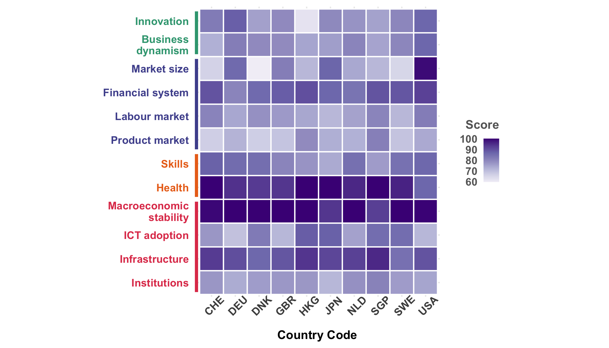
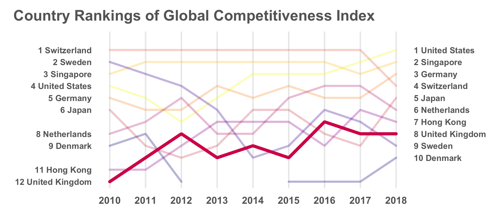
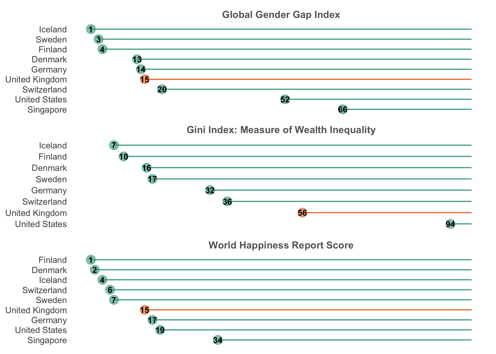
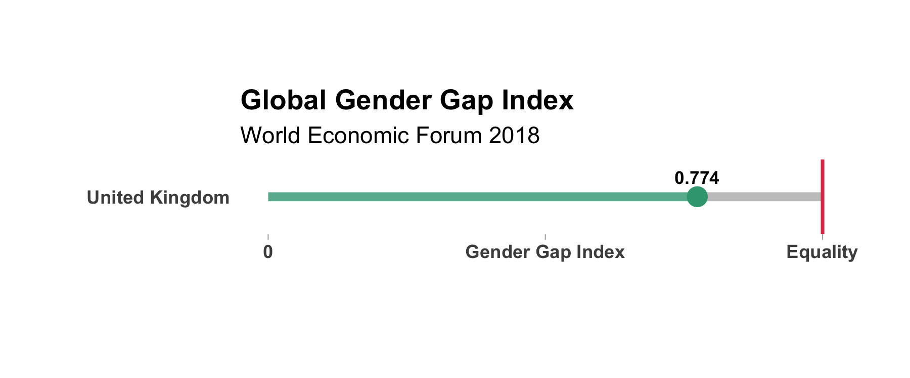
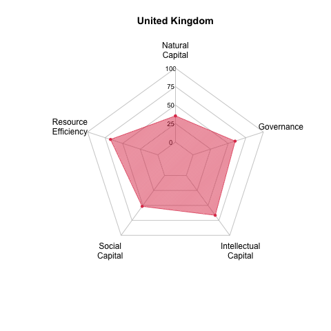
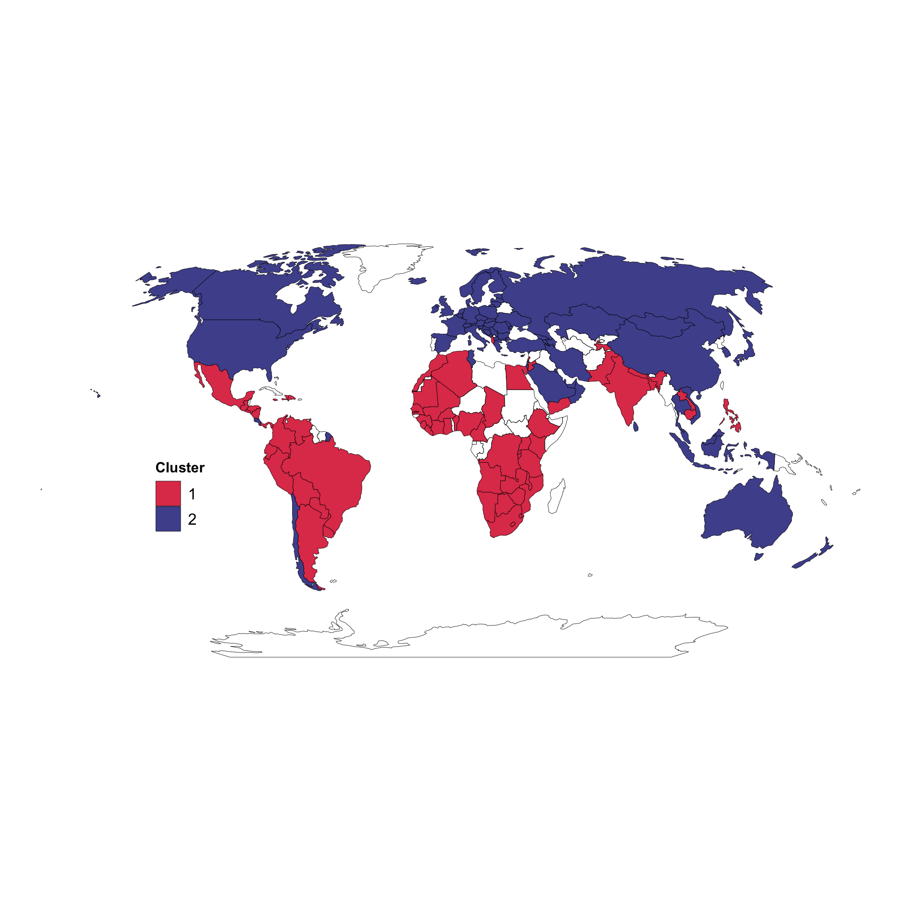
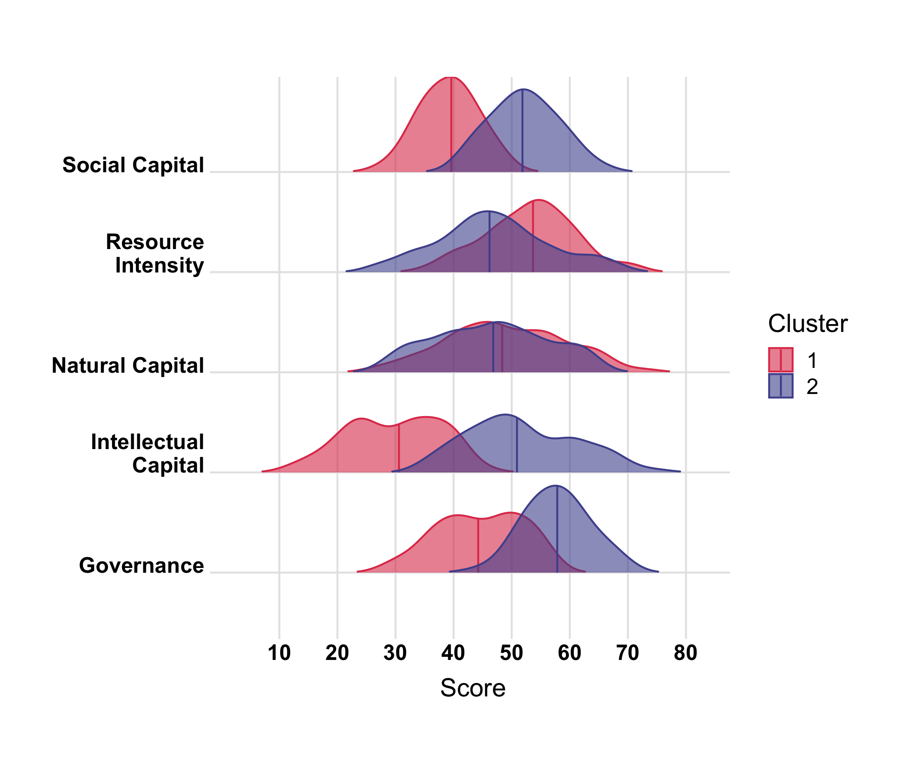

# Analysis of social equity & environmental sustainability on the backdrop of economic competitiveness

### Analysis Questions
This [report](https://github.com/sarinasinghkhaira/gci_sustainability/blob/main/presentation/gci_slides.pdf) contains an analysis of the following questions:

* Which countries are excelling in creating sustainable & productive economies?
* How does the UK compare to these countries?
* In which areas does the UK need to improve?

All data processing and data visualisation was completed in R

## Key Visualisations

#### GCI Pillar Scores By Country
 

#### GCI Rankings 

#### Social Equity Global Rankings

#### Progress Bars 

#### Global Sustainability Index Pillar Scoring

## Clustering Analysis

#### Map of Clustered Countries 

#### GCSI Pillar Scores Between Clusters

### Data Sources

[SolAbility](https://solability.com/the-global-sustainable-competitiveness-index/the-index)
 
 - Global Sustainability Competitiveness Index

[World Bank World Develeopment Indicators](https://databank.worldbank.org/source/world-development-indicators)
 
 - Global Competitiveness Index   
 - Global Gender Gap Index  
 - Gini Index 

[Our World in Data](https://ourworldindata.org/co2-and-other-greenhouse-gas-emissions)  
 - CO2 & Emissions Data  

[Global Footprint Network](https://data.footprintnetwork.org/)  
 - Ecological Footprint & BioCapacity

[BP](https://www.bp.com/en/global/corporate/energy-economics/statistical-review-of-world-energy/downloads.html)  
 - Renewable Energy Consumption & Generation

[Sustainable Development Solutions Network](https://www.kaggle.com/unsdsn/world-happiness)  
 - World Happiness Score

